# Jarkom_Modul4_Lapres_E5  

---
### 5111840000088 Angelita Titiandes Br. Silalahi  
### 5111840000150 Alberto Sanjaya  

---

## Pengerjaan Soal  
Berikut ini gambar dari jaringan yang terdapat pada soal  
  

1. Membuat subnetting dan routing pada Cisco Packet Tracer  
Berikut perhitungan subnetting dari jaringan yang terbentuk dengan menggunakan metode **Classless VLSM**  

Pertama, membagi jaringan pada soal menjadi 13 subnet seperti pada gambar berikut  
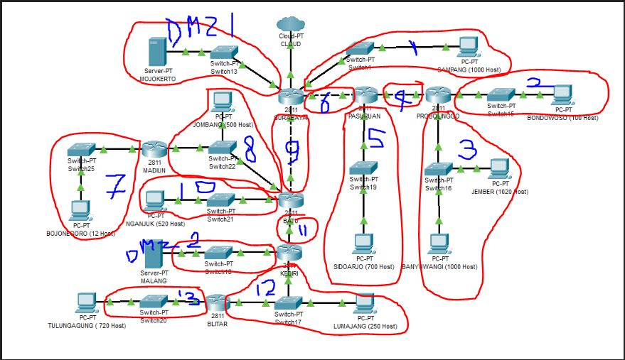  

Berikutnya untuk pembagian berdasarkan jumlah yang diperlukan dan didapatkan tabel berikut  
Nama | Perlu | Submask  
-----|-------|--------  
A1 | 1001 | /22  
A2 | 101 | /25  
A3 | 2021 | /21  
A4 | 2 | /30  
A5 | 701 | /22  
A6 | 2 | /30  
A7 | 13 | /28  
A8 | 502 | /23  
A9 | 2 | /30  
A10 | 521 | /22  
A11 | 2 | /30  
A12 | 252 | /24  
A13 | 721 | /22  
Total | 5841 | /19  

Untuk pembagian IPnya menggunakan tree terbagi menjadi  
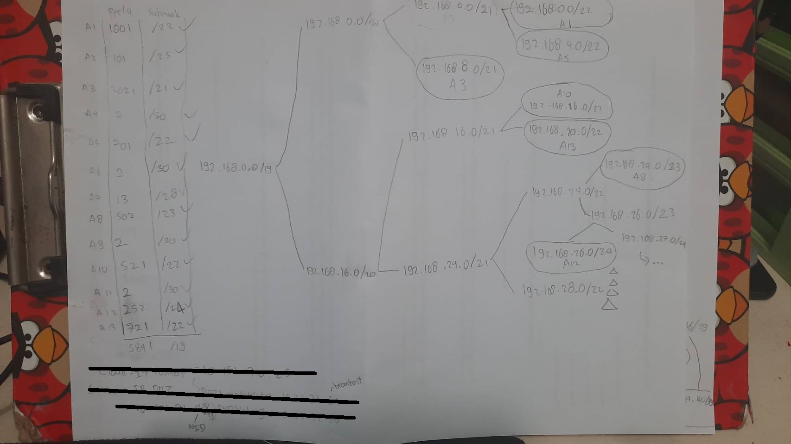  
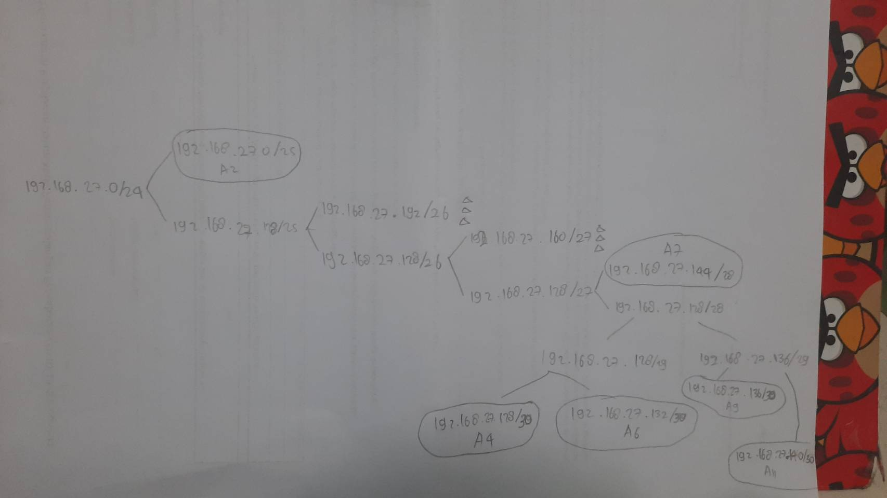  

Dan untuk 'server' yaitu dengan menggunakan IP DMZ Kelompok masing-masing yang akan dibentuk dari DMZ ```10.151.71.48/29``` dimana terbagi berdasarkan tree berikut  
  

sehingga menghasilkan pembagian IP sebagai berikut  
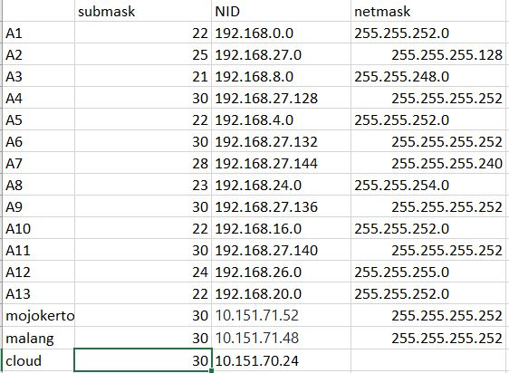  

untuk file **.pkt** terdapat pada 
[CPT File](https://github.com/Alberto0150/Jarkom_Modul4_Lapres_E5/blob/main/jawaban/praktikum%201%20cisco%20vlsm%20fix%20backup%20harusnya%20sudah.pkt)  

Dimana ketika diuji sudah dapat mengirim pesan satu sama lain sesuai dengan uji dari asisten penguji  

2. Membuat subnetting dan routing pada UML dimana terdapat ketentuan berupa :  
- Memori hanya sebesar **64MB** pada tiap UML  

Berikut perhitungan subnetting dari jaringan yang terbentuk dengan menggunakan metode **Classless CIDR**  

Pertama adalah dengan membuat pembagian jaringan seperti pada gambar berikut:  
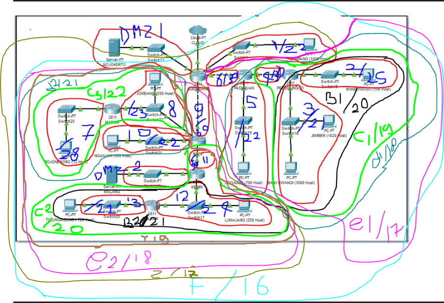  

Untuk pembagian IP menggunakan tree adalah sebagai berikut  
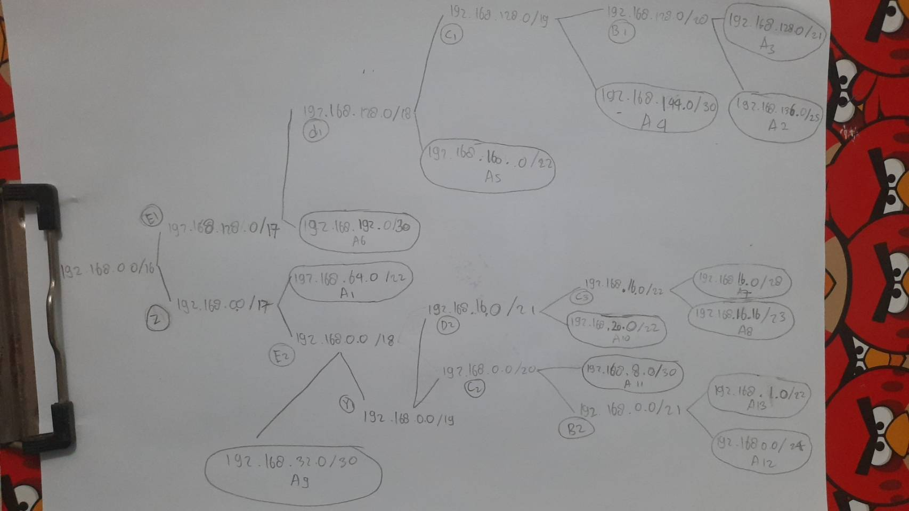  

Berikutnya adalah membuat file ```topo.sh``` yang berisi  

```
# Switch

uml_switch -unix switch1 > /dev/null < /dev/null & 
uml_switch -unix switch2 > /dev/null < /dev/null & 
uml_switch -unix switch3 > /dev/null < /dev/null & 
uml_switch -unix switch7 > /dev/null < /dev/null & 
uml_switch -unix switch11 > /dev/null < /dev/null & 
uml_switch -unix switch13 > /dev/null < /dev/null & 
uml_switch -unix switch15 > /dev/null < /dev/null & 
uml_switch -unix switch16 > /dev/null < /dev/null & 
uml_switch -unix switch17 > /dev/null < /dev/null & 
uml_switch -unix switch18 > /dev/null < /dev/null & 
uml_switch -unix switch19 > /dev/null < /dev/null & 
uml_switch -unix switch21 > /dev/null < /dev/null & 
uml_switch -unix switch20 > /dev/null < /dev/null & 
uml_switch -unix switch22 > /dev/null < /dev/null & 
uml_switch -unix switch25 > /dev/null < /dev/null & 


# Router
xterm -T SURABAYA -e linux ubd0=SURABAYA,jarkom umid=SURABAYA eth0=tuntap,,,10.151.70.25 eth1=daemon,,,switch1 eth2=daemon,,,switch2 eth3=daemon,,,switch7 eth4=daemon,,,switch13 mem=64M &
xterm -T PASURUAN -e linux ubd0=PASURUAN,jarkom umid=PASURUAN eth0=daemon,,,switch2 eth1=daemon,,,switch3 eth2=daemon,,,switch19 mem=64M &
xterm -T PROBOLINGGO -e linux ubd0=PROBOLINGGO,jarkom umid=PROBOLINGGO eth0=daemon,,,switch3 eth2=daemon,,,switch15 eth3=daemon,,,switch16 mem=64M &
xterm -T BATU -e linux ubd0=BATU,jarkom umid=BATU eth0=daemon,,,switch7 eth1=daemon,,,switch11 eth2=daemon,,,switch21 eth3=daemon,,,switch22 mem=64M &
xterm -T MADIUN -e linux ubd0=MADIUN,jarkom umid=MADIUN eth0=daemon,,,switch22 eth1=daemon,,,switch25 mem=64M &
xterm -T KEDIRI -e linux ubd0=KEDIRI,jarkom umid=KEDIRI eth0=daemon,,,switch11 eth1=daemon,,,switch17 eth2=daemon,,,switch18 mem=64M &
xterm -T BLITAR -e linux ubd0=BLITAR,jarkom umid=BLITAR eth0=daemon,,,switch17 eth1=daemon,,,switch20 mem=64M &


# Server

xterm -T MALANG -e linux ubd0=MALANG,jarkom umid=MALANG eth0=daemon,,,switch18 mem=64M &
xterm -T MOJOKERTO -e linux ubd0=MOJOKERTO,jarkom umid=MOJOKERTO eth0=daemon,,,switch13 mem=64M &

# Klien 
xterm -T SAMPANG -e linux ubd0=SAMPANG,jarkom umid=SAMPANG eth0=daemon,,,switch1 mem=64M &
xterm -T SIDOARJO -e linux ubd0=SIDOARJO,jarkom umid=SIDOARJO eth0=daemon,,,switch19 mem=64M &
xterm -T BANYUWANGI -e linux ubd0=BANYUWANGI,jarkom umid=BANYUWANGI eth0=daemon,,,switch16 mem=64M &
xterm -T JEMBER -e linux ubd0=JEMBER,jarkom umid=JEMBER eth0=daemon,,,switch16 mem=64M &
xterm -T BONDOWOSO -e linux ubd0=BONDOWOSO,jarkom umid=BONDOWOSO eth0=daemon,,,switch15 mem=64M &
xterm -T JOMBANG -e linux ubd0=JOMBANG,jarkom umid=JOMBANG eth0=daemon,,,switch22 mem=64M &
xterm -T BOJONEGORO -e linux ubd0=BOJONEGORO,jarkom umid=BOJONEGORO eth0=daemon,,,switch25 mem=64M &
xterm -T NGANJUK -e linux ubd0=NGANJUK,jarkom umid=NGANJUK eth0=daemon,,,switch21 mem=64M &
xterm -T LUMAJANG -e linux ubd0=LUMAJANG,jarkom umid=LUMAJANG eth0=daemon,,,switch17 mem=64M &
xterm -T TULUNGAGUNG -e linux ubd0=TULUNGAGUNG,jarkom umid=TULUNGAGUNG eth0=daemon,,,switch20 mem=64M &
``` 
Dan juga membuat ```bye.sh``` yang berisi  
```
uml_mconsole SURABAYA halt
uml_mconsole PASURUAN halt 
uml_mconsole PROBOLINGGO halt
uml_mconsole BATU halt
uml_mconsole MADIUN halt
uml_mconsole KEDIRI halt
uml_mconsole BLITAR halt
uml_mconsole MALANG halt
uml_mconsole MOJOKERTO halt
uml_mconsole SAMPANG halt 
uml_mconsole SIDOARJO halt
uml_mconsole BANYUWANGI halt
uml_mconsole JEMBER halt
uml_mconsole BONDOWOSO halt
uml_mconsole JOMBANG halt 
uml_mconsole BOJONEGORO halt 
uml_mconsole NGANJUK halt 
uml_mconsole LUMAJANG halt 
uml_mconsole TULUNGAGUNG halt 
```
untuk mengakhiri pengunaan UML nantinya.  

Setelah melakukan ``` bash topo.sh``` maka akan tampil sebanyak 19 UML dimana pada  setiap UMLnya diberikan setting yang berbeda-beda  
pada ```nano /etc/network/interfaces``` Surabaya  

```
auto lo  
iface lo inet loopback  

auto eth0   
iface eth0 inet static  
address 10.151.70.26  
netmask 255.255.255.252  
gateway 10.151.70.25  

auto eth1  
iface eth1 inet static  
address 10.151.71.53  
netmask 255.255.252.252  

auto eth2  
iface eth2 inet static  
address 192.168.64.1  
netmask 255.255.252.0  

auto eth3  
iface eth3 inet static  
address 192.168.32.1  
netmask 255.255.255.252  

auto eth4  
iface eth4 inet static  
address 192.168.192.1  
netmask 255.255.255.252  
```  
pada ```nano /etc/network/interfaces``` Pasuruan  
```
auto lo  
iface lo inet loopback  

auto eth0  
iface eth0 inet static  
address 192.168.192.2  
netmask 255.255.255.252  
gateway 192.168.192.1  

auto eth1  
iface eth1 inet static  
address 192.168.144.1  
netmask 255.255.255.252  

auto eth2  
iface eth2 inet static  
address 192.168.160.1  
netmask 255.255.252.0  
```  
pada ```nano /etc/network/interfaces``` Probolinggo  
```
auto lo  
iface lo inet loopback  

auto eth0  
iface eth0 inet static  
address 192.168.144.2  
netmask 255.255.255.252  
gateway 192.168.144.1  

auto eth1  
iface eth1 inet static  
address 192.168.136.1  
netmask 255.255.255.128  

auto eth2  
iface eth2 inet static  
address 192.168.128.1  
netmask 255.255.248.0  
```  

pada ```nano /etc/network/interfaces``` Sidoarjo  
```
auto lo  
iface lo inet loopback  

auto eth0  
iface eth0 inet static  
address 192.168.160.2  
netmask 255.255.255.0  
gateway 192.168.160.1  
```  
pada ```nano /etc/network/interfaces``` Bondowoso  
```
auto lo  
iface lo inet loopback  

auto eth0  
iface eth0 inet static  
address 192.168.136.2  
netmask 255.255.255.128  
gateway 192.168.136.1  
```  

pada ```nano /etc/network/interfaces``` Jember  
```
auto lo  
iface lo inet loopback  

auto eth0  
iface eth0 inet static  
address 192.168.128.3  
netmask 255.255.248.0  
gateway 192.168.128.1  
```  

pada ```nano /etc/network/interfaces``` Banyuwangi  
```
auto lo  
iface lo inet loopback  

auto eth0  
iface eth0 inet static  
address 192.168.128.2  
netmask 255.255.248.0  
gateway 192.168.128.1  
```  

pada ```nano /etc/network/interfaces``` Malang  
```
auto lo  
iface lo inet loopback  

auto eth0  
iface eth0 inet static  
address 10.151.71.49  
netmask 255.255.255.252  
gateway 10.151.71.50  
```  
pada ```nano /etc/network/interfaces``` Mojokerto  
```
auto lo
iface lo inet loopback

auto eth0
iface eth0 inet static
address 10.151.77.54
netmask 255.255.255.252
gateway 10.151.77.53
```  

pada ```nano /etc/network/interfaces``` Sampang  
```
auto lo
iface lo inet loopback

auto eth0
iface eth0 inet static
address 192.168.64.2
netmask 255.255.255.0
gateway 192.168.64.1
```  

pada ```nano /etc/network/interfaces``` Madiun  
```
auto lo
iface lo inet loopback

auto eth0
iface eth0 inet static
address 192.168.16.18
netmask 255.255.254.0
gateway 192.168.16.17

auto eth1
iface eth1 inet static
address 192.168.16.1
netmask 255.255.255.240
```  

pada ```nano /etc/network/interfaces``` Bojonegoro  
```
auto lo
iface lo inet loopback

auto eth0
iface eth0 inet static
address 192.168.16.2
netmask 255.255.255.240
gateway 192.168.16.1
```  

pada ```nano /etc/network/interfaces``` Batu  
```
auto lo
iface lo inet loopback

auto eth0
iface eth0 inet static
address 192.168.32.2
netmask 255.255.255.252
gateway 192.168.32.1

auto eth1
iface eth1 inet static
address 192.168.16.17
netmask 255.255.255.252 

auto eth2
iface eth2 inet static
address 192.168.20.1
netmask 255.255.252.0 

auto eth3
iface eth3 inet static
address 192.168.8.1
netmask 255.255.255.252 
```  

pada ```nano /etc/network/interfaces``` Jombang  
```
auto lo
iface lo inet loopback

auto eth0
iface eth0 inet static
address 192.168.16.19
netmask 255.255.254.0
gateway 192.168.16.17
```  

pada ```nano /etc/network/interfaces``` Nganjuk  
```
auto lo
iface lo inet loopback

auto eth0
iface eth0 inet static
address 192.168.20.2
netmask 255.255.252.0
gateway 192.168.20.1
```  

pada ```nano /etc/network/interfaces``` Kediri  
```
auto lo
iface lo inet loopback

auto eth0
iface eth0 inet static
address 192.168.8.2
netmask 255.255.255.252
gateway 192.168.8.1

auto eth1
iface eth1 inet static
address 192.168.0.1
netmask 255.255.255.0

auto eth2
iface eth2 inet static
address 10.151.71.50
netmask 255.255.255.252 
#batu blitar malang done
```  
pada ```nano /etc/network/interfaces``` Blitar  
```
auto lo
iface lo inet loopback

auto eth0
iface eth0 inet static
address 192.168.0.2
netmask 255.255.255.0
gateway 192.168.0.1

auto eth1
iface eth1 inet static
address 192.168.1.1
netmask 255.255.252.0
```  

pada ```nano /etc/network/interfaces``` Lumajang  
```
auto lo
iface lo inet loopback

auto eth0
iface eth0 inet static
address 192.168.0.3
netmask 255.255.252.0
gateway 192.168.0.1
```  

pada ```nano /etc/network/interfaces``` Tulungagung  
```
auto lo
iface lo inet loopback

auto eth0
iface eth0 inet static
address 192.168.1.2
netmask 255.255.252.0
gateway 192.168.1.1
```  

Berikutnya, melakukan ```nano rut.sh``` pada beberapa router yang berisi ``` ip add route``` yang dapat dijalankan setiap uml mengalami restart. dimana terdiri menjadi:  

Pada Surabaya terdapat 12 ip route yang terdiri dari  
```
ip route add 192.168.136.0/25 via 192.168.192.2 
ip route add 192.168.128.0/21 via 192.168.192.2 
ip route add 192.168.144.0/30 via 192.168.192.2 
ip route add 192.168.160.0/22 via 192.168.192.2 

ip route add 10.151.71.52/30 via 10.151.71.54  

ip route add 192.168.16.0/28 via 192.168.32.2  
ip route add 192.168.16.0/23 via 192.168.32.2  
ip route add 192.168.20.0/22 via 192.168.32.2  
ip route add 192.168.8.0/30 via 192.168.32.2  
ip route add 192.168.0.0/24 via 192.168.32.2  
ip route add 192.168.0.0/22 via 192.168.32.2  

ip route add 10.151.71.48/30 via 192.168.32.2  
```  
Pada Pasuruan terdapat 2 routing  
```
ip route add 192.168.136.0/25 via 192.168.144.2  
ip route add 192.168.128.0/21 via 192.168.144.2  
```  
Pada Batu terdapat 4 routing  
```
ip route add 192.168.16.0/28 via 192.168.16.18  
ip route add 10.151.71.48/30 via 192.168.8.2  
ip route add 192.168.0.0/24 via 192.168.8.2  
ip route add 192.168.1.0/24 via 192.168.8.2  
```  
Pada Kediri terdapat 1 routing
```
ip route add 192.168.1.0/22 via 192.168.0.2 
```  
Routing2 yang sudah dibuat dalam ``` rut.sh``` tadi, dapat dijalankan dengan ``` bash rut.sh``` yang nantinya ketika mengetikan ``` ip route show```, maka akan muncul route-route yang sudah dibuat.  

Berikut beberapa contoh ping:  
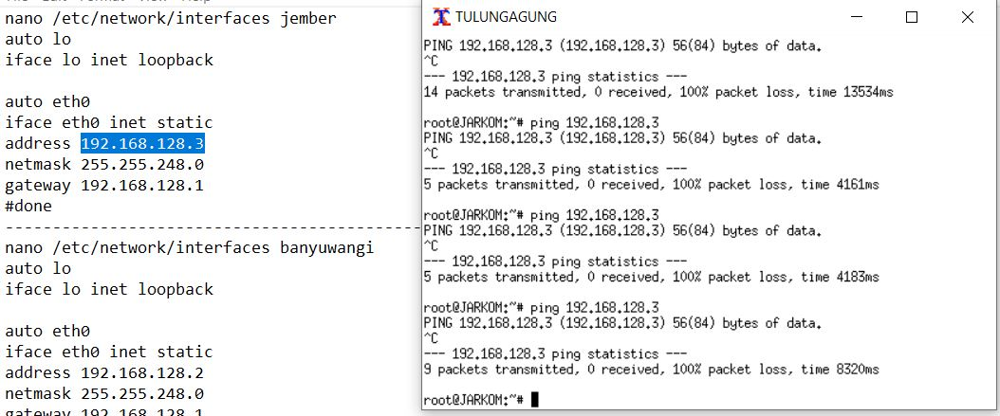  
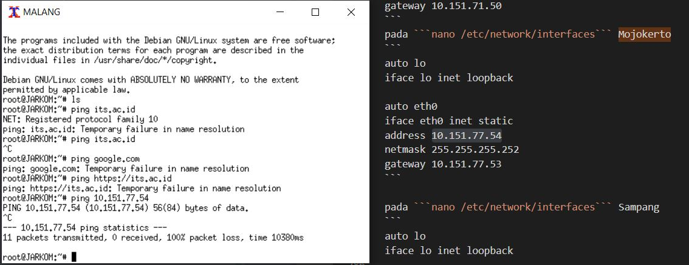  
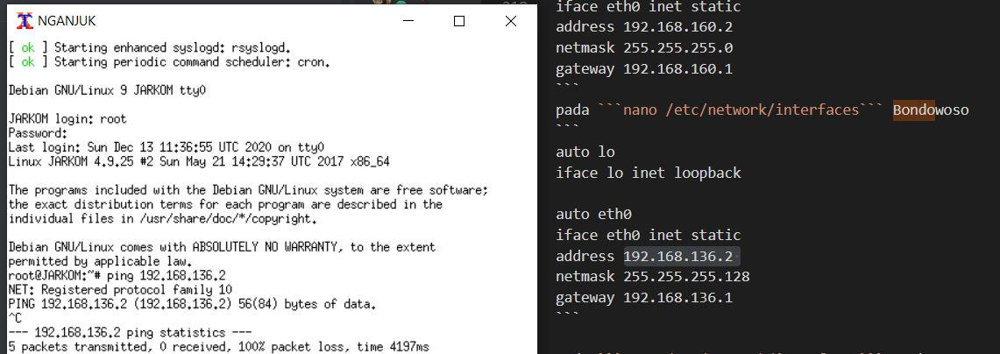  

---

Kendala yang dialami:  
Kendala yang sempat terjadi namun sudah tuntas  
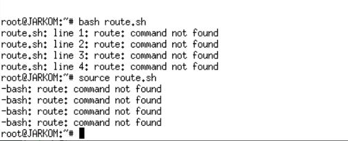  
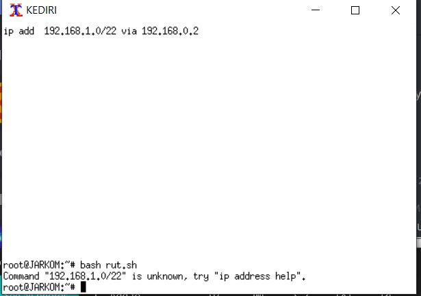  
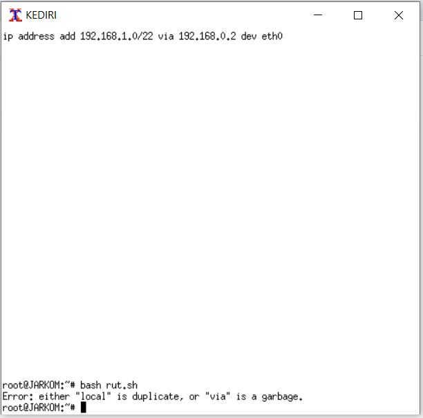  